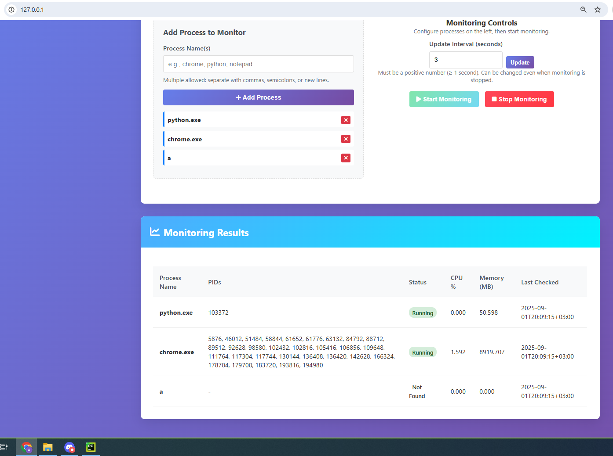
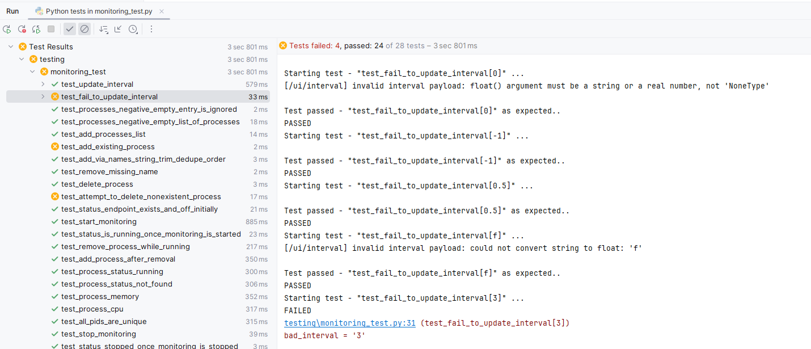

# PID Patrol

A lightweight FastAPI app that monitors specific processes by **exact name** and reports CPU & memory in a clean web UI and JSON API. Ideal for quick local checks (“is `python.exe` running?”) and for API‑driven testing with pytest.

## Table of Contents
- [Features](#features)
- [Screenshots](#screenshots)
- [Requirements](#requirements)
- [Quick Start](#quick-start)
- [Run](#run)
- [Usage](#usage)
- [API Reference](#api-reference)
- [Testing](#testing)
- [Project Structure](#project-structure)
- [Troubleshooting](#troubleshooting)
- [Notes & Tips](#notes--tips)
- [License](#license)

---

## Features

- **Server‑rendered dashboard** (Jinja2) with periodic refresh
- **Exact process‑name matching** (case‑insensitive; no substrings)
- **Safe runtime controls:** add/remove names, change interval, start/stop
- **Consistent JSON schema** for `/ui/status` and `/ui/results`
- **Edge‑case handling:** blanks, whitespace, duplicates, invalid interval
- **Pytest E2E tests** that drive the HTTP endpoints

---

## Screenshots

> The repo includes example screenshots under `docs/images/`.

**Linux:**  


**Windows:**  


**PyCharm test run:**  


---

## Requirements

- Python **3.9+**
- Packages:
  - `fastapi`
  - `uvicorn`
  - `psutil`

Install via `requirements.txt` or directly:

```bash
pip install fastapi==0.116.1 uvicorn==0.35.0 psutil==7.0.0
```

---

## Quick Start

```bash
# 1) Clone & enter
git clone <your-repo-url> pid-patrol
cd pid-patrol

# 2) (Recommended) set up venv
python -m venv .venv
# Windows:
. .venv/Scripts/activate
# Linux/macOS:
source .venv/bin/activate

# 3) Install deps
pip install -r requirements.txt
# or
pip install fastapi==0.116.1 uvicorn==0.35.0 psutil==7.0.0
```

---

## Run

```
python driver.py
```
Defaults to `127.0.0.1:80`. If port 80 needs elevation, switch to a user port (e.g., 8000) or run elevated.

---

## Usage

1. **Add process names** in the left panel (comma/semicolon/newline separated).  
   - Input is trimmed and **de‑duplicated** while preserving **first‑seen order**.
2. **Set update interval** (seconds). Minimum is **1.0**.
3. Click **Start Monitoring**. Results will appear in the table and are also available via the API.

**Matching is exact (case‑insensitive).** On Windows, use full image names (e.g., `chrome.exe`, `python.exe`).

---

## API Reference

All endpoints are JSON unless otherwise noted. Successful calls return **200**. Validation errors return **409** with `{"ok": false, "error": "..."}`.

### `GET /`
Returns the HTML dashboard (SSR).

### `GET /ui/status`
Current state:
```json
{
  "ok": true,
  "running": true,
  "interval": 3.0,
  "processes": ["python.exe", "chrome.exe"],
  "timestamp": "2025-09-01T20:09:15+03:00"
}
```

### `GET /ui/results`
- **204** when monitoring is **stopped** or the process list is **empty**
- **200** when active, with:
```json
{
  "ok": true,
  "running": true,
  "interval": 3.0,
  "count": 2,
  "results": [
    {
      "name": "python.exe",
      "pids": [103372],
      "status": "Running",
      "cpu_percent": 0.0,
      "memory_mb": 50.598,
      "last_checked": "2025-09-01T20:09:15+03:00"
    }
  ],
  "timestamp": "2025-09-01T20:09:15+03:00"
}
```

### `POST /ui/add`
Add/merge process names.

- String payload:
```json
{"names": "chrome, python; notepad\npython"}
```
- List payload:
```json
{"processes": ["chrome", "python", "notepad"]}
```

**Rules:** trims, removes empties, **de‑dupes** (first‑seen order). Missing/empty → `409`.

### `POST /ui/remove`
Remove one process name:
```json
{"name": "python.exe"}
```
Missing/blank name → `409`. Removing a non‑existing name is a **no‑op** (`200`).

### `POST /ui/interval`
Update the polling interval (seconds):
```json
{"interval": 2}
```
Accepts numeric types or numeric strings (e.g., `"2"`). Must be **>= 1.0**; invalid → `409`.

### `POST /ui/start`
Start monitoring. Optional payload to **replace** the set and/or override the interval:
```json
{"interval": 2, "processes": ["python.exe", "chrome.exe"]}
```

### `POST /ui/stop`
Stop monitoring:
```json
{"ok": true, "is_running": false}
```

---

## Testing

The suite uses `pytest`, launches Uvicorn once per module, and calls the HTTP endpoints directly.

```bash
pip install pytest
pytest -q -s
```

Included scenarios:
- Interval happy‑path and invalid payloads
- Add/de‑dupe/trim behavior
- Start/stop lifecycle; `/ui/results` → `204` after stop
- Removing while running; re‑adding
- **PID correctness**: lists of positive integers, no duplicates per row and no PID shared across different process rows

> PyCharm tip: add `-s` to the run configuration to see `print()` output.

---

## Project Structure

```
.
├─ web_dashboard.py            # FastAPI app + routes  (or dashboards/web_dashboard.py in a package)
├─ templates/
│  └─ index.html               # dashboard (SSR)
├─ static/
│  └─ css/monitor.css          # styling
├─ testing/
│  └─ monitoring_test.py       # E2E tests
├─ driver.py                   # uvicorn launcher
├─ docs/
│  └─ images/                  # screenshots used in README
├─ requirements.txt
└─ README.md
```

---

## Troubleshooting

- **Port 80 permission denied** → use a user port (e.g., 8000) or run elevated.
- **Windows matching** → use full image names (`chrome.exe`, not `chrome`).
- **`/ui/results` returns 204** → monitoring is stopped or process list is empty.
- **Many PIDs for browsers** → expected (multi‑process architecture).

---

## Notes & Tips

- CPU% is normalized/capped; values are rounded to **3 decimals**.
- Status is derived from process states; if at least one instance is running, row status is **Running**.
- The API is stable for automation; avoid relying on response field ordering.

---

## License

Distributed under the MIT License.
